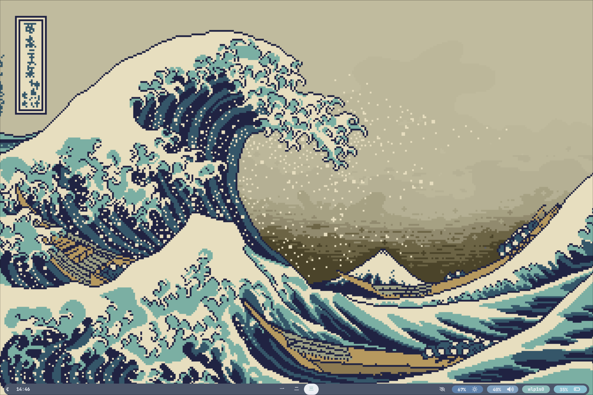
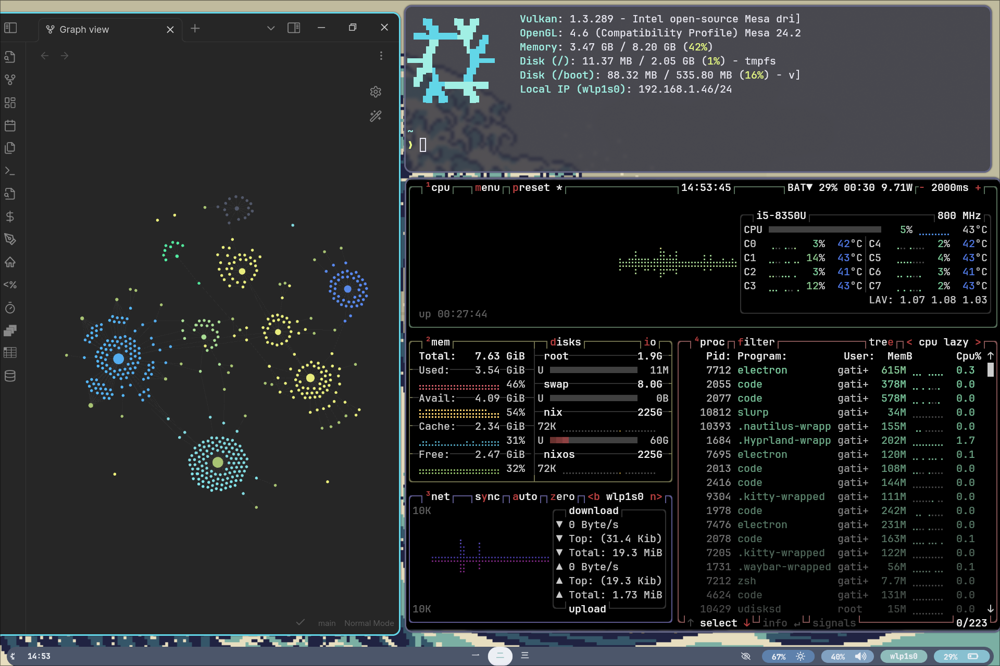

<h1 align="center">
    
   <br>
      Gatien NixOS Flakes
   <br>

   <div align="center">
      <p></p>
      <div align="center">
         <a href="https://github.com/gatienc/NixFlakes/">
            
         </a>
         <a href="https://nixos.org">
            
         </a>
         <a href="https://github.com/gatienc/NixFlakes/blob/main/LICENSE">
            
         </a>
      </div>
      <br>

   </div>
</h1>

### 🖼️ Gallery

<p align="center">
    <br>
    <br>
    <br>
   Screenshots last updated <b>2024-09-28</b>
   </p>

## 📚 Layout

- [flake.nix](flake.nix) base of the configuration
- [hosts](hosts) 🌳 per-host configurations that contain machine specific configurations and select the specied modules
  - [Glacius](hosts/glacius/) 🖥️ Desktop specific configuration
  - [icicle](hosts/icicle/) 💻 Laptop specific configuration
  - [vm](hosts/droplet/) 🗄️ Raspberry pi specific configuration
- [modules](modules) 🍱 modularized NixOS configurations
  - [core](modules/core/) ⚙️ Core config
  - [homes](modules/home/) 🏠 [Home-Manager](https://github.com/nix-community/home-manager) config
- [wallpapers](assets/wallpaper/) 🌄 wallpapers collection

```bash
sudo nixos-rebuild switch --flake .#HOSTNAME
```

`initialHashedPassword`

```sh
$ nix-shell --run 'mkpasswd -m SHA-512 -s' -p mkpasswd
Password: your password
<hash output>
```

Find the new files created:

```sh
 sudo fd --one-file-system --base-directory / --type f --hidden --exclude "{tmp,etc/passwd}" | fzf
```

## 📝 Shell aliases

<details>
<summary>
Utils (EXPAND)
</summary>

- `c` $\rightarrow$ `clear`
- `cd` $\rightarrow$ `z`
- `tt` $\rightarrow$ `gtrash put`
- `vim` $\rightarrow$ `nvim`
- `cat` $\rightarrow$ `bat`
- `nano` $\rightarrow$ `micro`
- `code` $\rightarrow$ `codium`
- `py` $\rightarrow$ `python`
- `icat` $\rightarrow$ `kitten icat`
- `dsize` $\rightarrow$ `du -hs`
- `pdf` $\rightarrow$ `tdf`
- `open` $\rightarrow$ `xdg-open`
- `space` $\rightarrow$ `ncdu`
- `man` $\rightarrow$ `BAT_THEME='default' batman`
- `l` $\rightarrow$ `eza --icons  -a --group-directories-first -1`
- `ll` $\rightarrow$ `eza --icons  -a --group-directories-first -1 --no-user --long`
- `tree` $\rightarrow$ `eza --icons --tree --group-directories-first`
</details>

## Todo

- [ ] Add more wallpapers
- [ ] Modularize the elements of the configuration (Desktop environment, Programs, etc)

## Credits

Thanks to Will Bush, Vimjoyer and Frost-Phoenix which were the inspiration for this flake.
